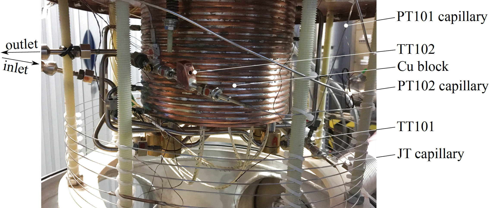
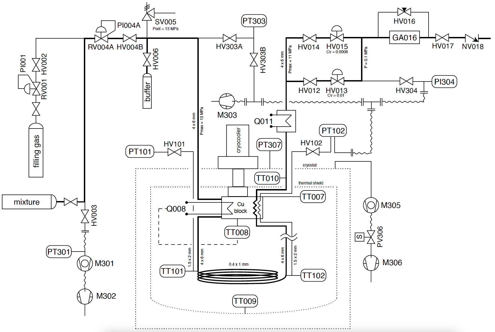

[](data/LICENSE.md)
[](https://doi.org/10.5281/zenodo.20444865)

<h1> Measurements of the Joule-Thomson coefficient in cryogenic fluids </h1>

**Contributors**

- **Jakub Tkaczuk** &mdash; [ 0000-0001-7997-9423](https://orcid.org/0000-0001-7997-9423) &mdash; *design, testing, writing*
- **Nicolas Luchier** &mdash; [ 0000-0002-5852-4726](https://orcid.org/0000-0002-5852-4726) &mdash; *supervision*
- **François Millet** &mdash; [ 0000-0002-1240-0138](https://orcid.org/0000-0002-1240-0138) &mdash; *supervision*

## Introduction

This repository contains the raw data, processed data, and code used to obtain and analyse measurements of the Joule-Thomson coefficient in pure gases and mixtures at temperatures between 65 K and 180 K. It is the supporting dataset for the article submitted to the *Journal of Chemical & Engineering Data*.

The measurements from this repository validate the earlier-developed equations of state in the single-phase region. Indirect measurements are first acquired for pure fluids, allowing for the experiment validation and then for mixtures, providing new results to the study. The expanded relative standard uncertainty is calculated along with the Monte Carlo analysis for the combined uncertainty. The impact of the composition uncertainty on the Joule-Thomson coefficient is quantified for mixtures using the Monte Carlo simulations.

## System description

The fluid path starts at a 50 L high-pressure cylinder holding the pure fluid
or the pre-mixed binary mixture. The cylinder is connected through the
pressure-reducing valve `RV004A` to a 1 U.S. gallon (3.6 L) buffer volume
that smooths out the manual adjustments of the reducer and absorbs the slow
pressure decay of the supply cylinder, reducing the frequency of inlet
corrections from seconds to minutes.

Inside the cryostat (dashed envelope in the P&ID below), a copper block with
a brazed heat exchanger is mounted on the cold head of a Cryomech AL300
Gifford-McMahon cryocooler, capable of cooling the inlet flow from 300 K
down to about 40 K. A 6 m helical capillary (304L stainless steel,
0.4 mm × 1 mm ID × OD, 0.365 mm equivalent ID) imposes the isenthalpic
expansion. Two calibrated Lake Shore Cernox temperature sensors are placed
upstream (`TT101`, T_in) and downstream (`TT102`, T_out) of the capillary,
with their lead wires thermalised at the cold head. Pressure is measured at
the same two stations with Mensor CPT 6100 absolute-pressure transducers
(`PT101`, `PT102`; 0.01% FS, p_max = 13.7 MPa).



Two fine-control needle valves (`HV013`, `HV015`) are installed in parallel
downstream of `PT102` to give a broad range of flow regulation. The gas
analyser `GA016` (Stanford Research Systems BGA244HP) sits at the system
outlet so that the speed-of-sound-based composition measurement always
runs at atmospheric pressure (±0.1 mol-%).

The capillary is mounted in vacuum on a glass-fibre support inside a
multi-layer-insulated radiation shield thermalised at the cold head, so
that the residual heat exchange with the environment is dominated by axial
conduction along the tube wall.

All raw and processed data files use the P&ID tag names below for sensor
identification.



The principal sensors used for the Joule-Thomson analysis are:
- temperature: `TT101` (upstream) and `TT102` (downstream) Cernox sensors;
- pressure: `PT101` (upstream) and `PT102` (downstream) Mensor transducers;
- composition (mixtures only): `GA016` binary gas analyser.

### Equipment list

The components installed on the test bench, with their P&ID tag, function,
and manufacturer/model, are listed below.

#### Control

| P&ID tag  | Equipment type                 | Manufacturer and model         |
| --------- | ------------------------------ | ------------------------------ |
| RV001     | Pressure regulator             | Alphagaz LTH 400               |
| PI001     | Pressure indicator             | Alphagaz LTH 400               |
| HV002     | Diaphragm sealed valve         | Nupro SS-DSV51                 |
| HV003     | Diaphragm sealed valve         | Nupro SS-DSV51                 |
| RV004A    | Pressure regulator             | Alphagaz LTH 400               |
| PI004A    | Pressure indicator             | Alphagaz LTH 400               |
| HV004B    | Diaphragm sealed valve         | Nupro SS-DSV51                 |
| SV005     | Safety valve                   | Swagelok SS-6R3A-MM            |
| HV006     | Diaphragm sealed valve         | Nupro SS-DSV51                 |
| TT007     | Platinum temperature sensor    |                                |
| TT008     | Platinum temperature sensor    |                                |
| Q008      | Resistive heater in copper mass|                                |
| TT009     | Platinum temperature sensor    |                                |
| TT010     | Platinum temperature sensor    |                                |
| Q011      | Resistive heater               |                                |
| HV012     | Diaphragm sealed valve         | Swagelok SS-DLVC04             |
| HV013     | Needle valve                   | Hoke Mili-Mite 1335G4Y         |
| HV014     | Diaphragm sealed valve         | Swagelok SS-DLVC04             |
| HV015     | Needle valve                   | Hoke Micromite 1654G4YA        |
| HV016     | Needle valve                   | Swagelok SS-4BMW-VCR           |
| HV017     | Diaphragm sealed valve         | Swagelok SS-DLVC04             |
| NV018     | Check valve                    | Swagelok                       |
| cryocooler| Gifford-McMahon refrigerator   | Cryomech AL300                 |

#### Measurement

| P&ID tag | Equipment type                | Manufacturer and model              |
| -------- | ----------------------------- | ----------------------------------- |
| GA016    | Gas analyser                  | SRS BGA244HP                        |
| PT101    | Absolute pressure transducer  | Mensor CPT 6100                     |
| TT101    | Cernox temperature sensor     | Lake Shore CX-1080-CU-HT-20L        |
| PT102    | Gauge pressure transducer     | Mensor CPT 6100                     |
| TT102    | Cernox temperature sensor     | Lake Shore CX-1050-SD-HT-1.4L       |

#### Vacuum

| P&ID tag | Equipment type              | Manufacturer and model |
| -------- | --------------------------- | ---------------------- |
| M301     | Turbo-molecular pump        | Alcatel                |
| PT301    | Vacuum pressure transmitter | Alcatel CF2P           |
| M302     | Roughing pump               | Alcatel                |
| HV303A   | Diaphragm sealed valve      | Nupro SS-DSV51         |
| HV303B   | Manual vacuum valve         |                        |
| M303     | Roughing pump               |                        |
| PT303    | Vacuum pressure transmitter | Adixen ACC2009-SP      |
| HV304    | Bellow sealed valve         | Swagelok SS-4H-V71     |
| PI304    | Pressure indicator          | Bourdon Haenni M1      |
| M305     | Turbo-molecular pump        |                        |
| M306     | Roughing pump               |                        |
| PV306    | Solenoid valve              |                        |
| PT307    | Vacuum pressure transmitter | Pfeiffer IKR 251       |

## Raw data

`raw-data` contains raw measurement data stored in CSV files. It contains:
- the pressure-temperature pairs used for indirect measurements of the Joule-Thomson coefficent in pure fluids (nitrogen, argon, helium-4);
- the pressure-temperature-composition values used for indirect measurements of the Joule-Thomson coefficient in fluid mixtures (helium-neon, helium-nitrogen).

| Variable    | Unit       | Description                                                                  |
| ----------- | ---------- | ---------------------------------------------------------------------------- |
| Date        | yyyy-mm-dd | Measurement date                                                             |
| Time        | hh:mm:ss   | Measurement time                                                             |
| PT102       | MPa        | Pressure measured after the isenthalpic expansion                            |
| PT101       | MPa        | Pressure measured before the isenthalpic expansion                           |
| TT009       | K          | Themal shield highest temperature (point of the highest radiation heat loss) |
| TT010       | K          | Temperature at the outlet from the cryostat (before heater Q011)             |
| TT008       | K          | Cold head temperature                                                        |
| TT101       | K          | Temperature measured before the isenthalpic expansion                        |
| RT101       | $\Omega$   | Resistance of the TT101 Cernox temperature sensor                            |
| TT102       | K          | Temperature measured after the isenthalpic expansion                         |
| RT102       | $\Omega$   | Resistance of the TT102 Cernox temperature sensor                            |
| Q008        | W          | Power of the cold head heater (automaticaly regulated)                       |
| x1          | -          | 1st gas concentration (for mixture measurements)                             |
| x2          | -          | 2nd gas concentration (for mixture measurements)                             |
| impurity    | -          | Gas impurity defined as $1 - purity$ (for single component measurements)     |
| err(x)      | -          | Concentration/purity measurement uncertainty                                 |

The measurements for two dates do not contain values for Q008: 2020-11-27 and 2020-12-14.

The measurements are grouped in files by collection date. The Joule-Thomson coefficient was measured for the fluids below:

| Date       | Fluid            | Average purity | Average molar composition |
| ---------- | ---------------- | -------------- | ------------------------- |
| 2020-11-27 | ${\rm N_2}$      | 0.9987         | -                         |
| 2020-12-09 | ${\rm N_2 - He}$ | -              | 0.8497/0.1503             |
| 2020-12-10 | ${\rm N_2 - He}$ | -              | 0.8909/0.1091             |
| 2020-12-11 | ${\rm N_2 - He}$ | -              | 0.5641/0.4359             |
| 2020-12-14 | ${\rm N_2}$      | 0.9904         | -                         |
| 2020-12-15 | ${\rm Ar}$       | 0.9990         | -                         |
| 2020-12-16 | ${\rm N_2}$      | 0.9977         | -                         |
| 2020-12-17 | ${\rm N_2}$      | 0.9986         | -                         |
| 2021-01-12 | ${\rm He}$       | 0.9967         | -                         |
| 2021-01-13 | ${\rm He}$       | 0.9904         | -                         |
| 2021-01-14 | ${\rm He - Ne}$  | -              | 0.7148/0.2852             |
| 2021-01-15 | ${\rm He - Ne}$  | -              | 0.7385/0.2615             |
| 2021-01-25 | ${\rm N_2}$      | 0.9977         | -                         |
| 2021-01-26 | ${\rm He}$       | 0.9993         | -                         |
| 2021-01-27 | ${\rm He - Ne}$  | -              | 0.3464/0.6536             |
| 2021-01-28 | ${\rm He - Ne}$  | -              | 0.4084/0.5916             |
| 2021-03-03 | ${\rm He - Ne}$  | -              | 0.2219/0.7781             |
| 2021-03-04 | ${\rm N_2}$      | 0.9987         | -                         |

## Derived data

`data/derived_data` contains the products computed from the raw data, documented
in [`data/derived_data/README.md`](data/derived_data/README.md):
- `p_T_pairs/` — steady-state pressure–temperature(–composition) points extracted from the raw time series, one file per isenthalp;
- `jt_coeffs/` — the derived Joule-Thomson coefficients with conventional and Monte Carlo uncertainties, a `jt_coefficients_summary.csv`, and a `jt_coefficients_detailed.json`;
- `calculated_mass_flow_rate/` — capillary-sizing design calculations.

Cernox temperature-sensor calibration data are in `data/cernox_calibration_data`,
and experiment metadata (timestamps, p–T pairs) in `data/metadata`.

## Code

The `src` directory consists of the following sub-directories:
- `data_acquisition` — code running data acquisition and real-time visualization of collected data;
- `data_analysis` — code for data wrangling and analysis of results (see [`src/data_analysis/README.md`](src/data_analysis/README.md)).

## Reproducing the analysis

The analysis requires Python with `numpy`, `pandas`, `scipy`, and `matplotlib`;
the reference thermodynamic properties require [REFPROP](https://www.nist.gov/srd/refprop)
and/or [CoolProp](http://www.coolprop.org/). The custom equations of state for
the mixtures are provided in `REFPROP/` and must be copied into REFPROP's
`HMX.BNC` file. Typical entry points:

```bash
python src/data_analysis/get_pT_pairs.py                 # extract p-T pairs from raw data
python src/data_analysis/calculate_jt_coefficients.py    # derive mu_JT with uncertainties
python src/data_analysis/plot_paper_results.py           # per-fluid result figures
```

## Citation

If you use this dataset or code, please cite it via the metadata in
[`CITATION.cff`](CITATION.cff) (a DOI is minted on
[Zenodo](https://zenodo.org/) with each release) and the associated article.

## License

This work is released under the [Creative Commons Attribution 4.0 International
(CC-BY-4.0)](LICENSE) license.

	